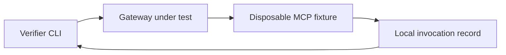

# Architecture — proposed AgentGate v0.1

**Status:** Narrow design contract for the conditional [WEDGE.md](WEDGE.md) pivot. Implementation is gated by [VALIDATION_PLAN.md](VALIDATION_PLAN.md). AgentGate v0.1 is a **local test tool**, not a production MCP proxy.

## Boundary and flow

An operator configures an existing gateway to route one disposable MCP server to AgentGate's test fixture, using that gateway's ordinary policy. AgentGate supplies a test MCP client and the fixture. It observes the fixture directly rather than trusting the gateway's own audit trail.

The fixture and verifier run on a trusted developer machine. Gateway deployment/configuration is operator supplied; AgentGate does not edit policies, create identities, or intercept traffic in production.

## Smallest supported contract

- **Protocol:** MCP **2026-07-28** over Streamable HTTP, tool discovery and invocation only. Construct proper per-request `_meta` and mandatory version/method/name headers; reject header/body mismatches and unsupported revisions. Do not reuse the 2025-11-25 initialization or session flow. Refer to the [current transport](https://modelcontextprotocol.io/specification/2026-07-28/basic/transports/streamable-http) and [tools](https://modelcontextprotocol.io/specification/2026-07-28/server/tools) specifications. Prefer the official SDK where it implements the target revision.
- **Local fixture:** Expose two harmless, distinguishable tools (`allow_probe` and `deny_probe`) with a run-scoped nonce argument. Track accepted `tools/call` arrivals by run ID, name, and sequence in memory. Return deterministic non-sensitive content. Bind loopback by default; never run real side-effect tools.
- **Gateway input:** An already running gateway URL pointing to that fixture, one operator-supplied test bearer token via an environment variable if needed, and the two expected tool names. The operator configures ALLOW for `allow_probe` and DENY for `deny_probe` on the same test identity. An unauthenticated fixture is supported; upstream OAuth, multiple upstreams, stdio and remote fixture deployments are outside v0.1.
- **Test order:** Create a fresh run ID; confirm the fixture is the expected upstream; call `allow_probe` through the gateway and observe **exactly one** fixture arrival and a successful client result. Then call `deny_probe` by name regardless of whether `tools/list` advertises it. Check that the client sees a denial/unknown-tool error and the fixture sees **zero** calls for that run during a documented bounded observation interval. Tool visibility is reported separately; hidden discovery is not confused with enforcement.
- **Result:** `PASS` only when both positive and negative controls and the observation prerequisites hold. `FAIL` if the denied tool is observed upstream, the allow control is blocked, duplicated, or mismatched, or the denied call succeeds. `INCONCLUSIVE` for missing observation, protocol/auth/setup errors, timeouts or untested routing. A client timeout after a forwarded call remains inconclusive about external side effects. Exit status: 0 pass, 1 fail, 2 inconclusive/config error; text summary plus optional machine-readable JSON. These are proposed CLI semantics, subject to validation, not implemented commands.

A bounded quiet period supports a reproducible observation claim; it **cannot** prove no delayed call will arrive later. A fixture record is evidence of that configured route at that time, not a security certification. A direct connection around the gateway is outside the tested path.

## Responsibilities and failure handling

| Component | Responsibility | Failure behavior |
| --- | --- | --- |
| Config/CLI | Validate URL, token environment-variable name, fixture address, timeouts, and expected tool names; redact credentials in all output. | Invalid config exits 2 before sending probes. |
| MCP client | Issue valid revision-specific discovery and calls; keep response and upstream observations separate. | Version/header/auth incompatibility is INCONCLUSIVE unless the gateway demonstrably forwards a forbidden call. |
| MCP fixture | Serve only the two synthetic tools; record all received calls, including unexpected names, with per-run isolation; respond deterministically. | If unreachable or observation incomplete, never report PASS. |
| Verdict/report | Correlate nonce and fixture call sequence; enforce positive control; emit bounded evidence and reasons. | Any forbidden fixture arrival is FAIL even when the gateway returns a denial; missing evidence is INCONCLUSIVE. |

No policy-language parser, server registry, production audit store, approval workflow, dashboard, hosted endpoint, or universal protocol proxy. Official MCP conformance testing remains a separate upstream tool; use it for protocol behavior instead of building a competing suite.
